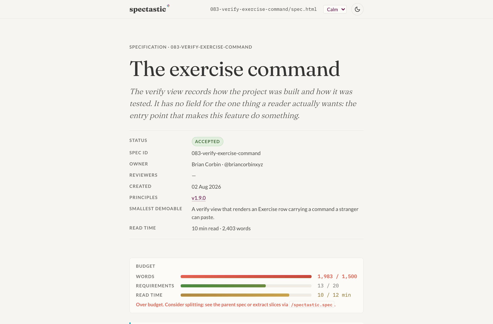

# Spectastic

> Single-file HTML specs. Every artifact in the lifecycle is one self-contained file that opens in a browser.

[](https://github.com/spectastic/spectastic/actions/workflows/ci.yml)
[](https://www.npmjs.com/package/@spectastic/cli)
[](https://www.npmjs.com/package/@spectastic/cli)
[](https://nodejs.org)
[](./LICENSE)

Spectastic runs a structured spec lifecycle — `principles → spec → design → tasks → implement → propose → apply → triage` — and emits a single self-contained `.html` file per artifact. The file uses a small vocabulary of semantic custom elements styled by a calm typographic system, so a spec reads like a quiet essay yet packs tables, diagrams, diffs, decision matrices, and progressive disclosure that flat prose can't.

**See it first:** open [`index.html`](./index.html) in a browser, then [`specs/000-spectastic/spec.html`](./specs/000-spectastic/spec.html) — the spec for spectastic itself, dogfooded.

<picture>
  <source media="(prefers-color-scheme: dark)" srcset="./docs/images/screenshot-spec-dark.png">
  
</picture>

## Quickstart

```sh
npx @spectastic/cli init
```

Node 20+. `init` runs in two passes — scan for conflicts, then write atomically:

```text
$ cd my-new-project && spectastic init --profile standard
spectastic init — summary
  wrote       24
  overwrote    0
  skipped      0

Next step:
  Open the project in Claude Code and run /spectastic.principles
  to author your project's principles.html.

✓ wrote .gitignore (spectastic ephemera)
✓ wrote spectastic.json schema reference (editor completion + key validation)
✓ wrote spectastic.json corpus config
  tip: `spectastic init --tools` installs the guarantee layer (pre-commit gate + auto-commit) — off by default.
```

Existing files prompt per-file `[y/N/a/s]` (default `N`). `--force` overwrites every conflict. In a non-TTY environment with conflicts the CLI refuses with exit code 2 and names `--force`, rather than hanging on a prompt nobody can answer.

From there, author your principles, then spec your first feature. Every verb is available both as a slash command in an agent session and as a headless CLI subcommand.

## Why HTML

A spec is read far more often than it is written, and the format decides how tiring that reading is. Three problems recur with flat-prose formats:

- **Review fatigue.** Long undifferentiated text; no progressive disclosure.
- **Thin structure.** No diagrams, no real tables, no inline annotation, no semantic anchors past headings.
- **Duplicated context.** Weak cross-linking means background gets restated in every artifact.

HTML fixes those directly. The challenge is keeping the source as editable as markdown — for humans and models alike. That's what the component vocabulary is for.

## The lifecycle

Ten commands. Eight are the **core** lifecycle, installed by default; two are **extended** and opt-in via `spectastic init --with <verb>`. The tiers are declared in [`commands.json`](./commands.json).

| Phase | Command | Output |
| --- | --- | --- |
| 1. Establish principles | `/spectastic.principles <project>` | `principles.html` |
| 2. Spec a feature | `/spectastic.spec <feature>` | `specs/<id>/spec.html` |
| 3. Design the build | `/spectastic.design <spec-id>` | `specs/<id>/design.html` |
| 4. Derive tasks | `/spectastic.tasks <spec-id>` | `specs/<id>/tasks.html` |
| 5. Implement a task | `/spectastic.implement <target>` | code edits + a ticked checkbox |
| 6. Propose a change | `/spectastic.propose <spec-id> <change>` | `specs/<id>/changes/<date>-<slug>/proposal.html` |
| 7. Apply an approved change | `/spectastic.apply <spec-id> <slug>` | live spec patched, change folder archived |
| 8. Triage a defect | `/spectastic.triage <failure>` | a classified card appended to a triage log |

| Extended | Command | What it does |
| --- | --- | --- |
| explain | `/spectastic.explain <target>` | A grounded, in-chat coaching read of a spec, requirement, decision, or file. Writes nothing; cites only real source. `--course` generates a persistent course with objectives, quizzes, and a mastery ledger. |
| explore | `/spectastic.explore <intent>` | Build to learn. Scaffolds a *quarantined* exploration you build loosely — and `validate` stays red until you graduate it into a real spec or delete it. |

The command files live in [`commands/`](./commands/). `spectastic init --tools` installs them as drift-proof adapters plus a pre-commit gate.

## What you get

Each row links to the spec that owns it in full.

| | |
| --- | --- |
| **A guarantee layer** | Command markdown is advisory, so a mandatory step written into it is a step a model can skip. `init --tools` moves the guarantees to the git boundary: a pre-commit gate that rejects a commit on any validation error, and adapters that reject a commit while an installed command has drifted from source. ([031](./specs/031-init-tools/spec.html)) |
| **Profiles** | A project's ambition is a dial, not a default. `init --profile lean\|standard\|verified\|enterprise` seeds a profile-shaped `principles.html` and a lean `AGENTS.md`, deterministically and with no model call. Brownfield-safe and additive — raising a profile keeps your edits. ([041](./specs/041-init-profiles/spec.html)) |
| **An enforcement floor** | A profile's rigor is only real if a gate can fail on it. `spectastic enforce` detects which enforcement categories your toolchain actually covers and exits non-zero when a hard-gate profile has a gap. It reports gaps; it never dictates a tool you already chose. ([042](./specs/042-profile-enforcement/spec.html)) |
| **A knowledge corpus** | A committed, greppable `knowledge/` directory shaped as a portable Agent Skill. Domain facts carry stable ids and provenance, and a design decision cites one *pinned to the edition it was read against* — so a later re-ingest can't silently change what a past decision claimed. ([051](./specs/051-knowledge-corpus/spec.html), and [`@spectastic/corpus`](./packages/corpus/README.md)) |
| **Change proposals** | A change to an accepted spec is a PR-shaped artifact with typed deltas, not an edit in place. Non-trivial proposals get an adversarial risk pass whose findings land as statused risks; apply refuses while any remains open. |
| **Sizing discipline** | A live size gauge in every spec header — words, requirements, read-time against a budget. A spec that crosses the threshold is signalled for splitting, and `spec --split` proposes value-ranked children with a coverage partition proving every requirement lands in exactly one. ([029](./specs/029-value-ranked-slicer/spec.html)) |
| **A small-batch loop** | `inbox.html` is the entry point for "a few small things". Paste a list, triage classifies each card, and the ones marked *just-do* are drained without a proposal cycle. |
| **A verification view** | A derived per-spec `verify.html` aggregating the success-criteria → acceptance → test trace, plus a Run block grounded in the commands that actually ran. Validation flags a view that has drifted from its bundle. ([021](./specs/021-verify-view/spec.html)) |
| **Artifact security** | Artifacts are data, not instructions. A deny-by-default content-security policy in every template, and a validation rule that errors on executable content in a spec. ([045](./specs/045-artifact-security/spec.html)) |
| **Git automation** | Opt-in, off by default. When on, a verb can stage and commit its own artifact with a derived message — and the assisting model is acknowledged as a distinct `Assisted-by:` trailer, never as an author. ([027](./specs/027-git-trailers/spec.html)) |

## The CLI

Twenty-five commands on one binary. The lifecycle verbs above all have a headless form; the rest are deterministic tools that make no model call.

```sh
spectastic --help                                   # the full surface
spectastic validate "specs/**/*.html"               # exits 1 on findings
spectastic enforce                                  # exits 1 on an uncovered required category
spectastic verify 021-verify-view                   # regenerate a spec's derived trace view
spectastic order --out roadmap.html                 # dependency-respecting value order over the corpus
spectastic spec 012-editor-ui --split               # propose a split of an over-budget draft
```

A second binary, `spectastic-corpus`, ships the corpus subsystem standalone — usable with no spec lifecycle present. See [its README](./packages/corpus/README.md).

## Validate in CI

```sh
spectastic validate --format sarif "specs/**/*.html" > spectastic.sarif
```

Human, JSON, and SARIF output. Two example workflows are under [`docs/ci-examples/`](./docs/ci-examples/) — GitHub Actions (uploads SARIF to Code Scanning) and GitLab CI (exposes SARIF as a SAST report). Both surface findings as inline PR/MR annotations.

## The artifact

<details>
<summary><strong>Component vocabulary</strong> — the tag name is the schema</summary>

| Element | Purpose |
| --- | --- |
| `<spec-meta>` | Header metadata — status, owner, version, dates. |
| `<spec-status>` | Inline pill — *draft / review / accepted / superseded / deprecated / blocked*. |
| `<spec-tldr>` | Boxed abstract, always near the top. |
| `<spec-requirement>` | Unit of conformance. Stable id + `priority="must\|should\|may"`. |
| `<spec-rule>` | Inline RFC 2119 keyword — `MUST` / `SHOULD` / `MAY`. |
| `<spec-decision>` | An [ADR](https://adr.github.io/) card — Context / Decision / Consequences. |
| `<spec-note>`, `<spec-warning>`, `<spec-question>`, `<spec-assumption>`, `<spec-tip>`, `<spec-example>` | Typed admonitions. |
| `<spec-tabs>` / `<spec-tab>` | Tab group — source / rendered / DOM, or before / after. |
| `<spec-diff>` | Red/green change block using semantic `<ins>` and `<del>`. |
| `<spec-matrix>` | Option × criterion decision table with a `data-winner` row. |
| `<spec-tradeoff>` | Inline bar sparklines scoring options on a few axes. |
| `<spec-arch>` | Frame around an inline SVG architecture sketch. |
| `<spec-conformance>` | Auto-built index of every requirement. |
| `<spec-glossary>` | Definition list with cross-linked `<dfn>` references. |
| `<spec-sidenote>` | Margin note for an aside that would interrupt the reading flow. |
| `<spec-newthought>` | Small-caps section opener. |
| `<spec-budget>` | Live size gauge — words / requirements / read-time against a budget. |
| `<spec-out-of-scope>` | Deferral register. Every entry requires a `defer-to=`, converting a scope cut from loss into deferral. |
| `<spec-risk>` / `<spec-risk-log>` | An adversarial finding and its register, each with a target and a status. |
| `<spec-slo>` | A service level objective descending from a quantified requirement. |
| `<spec-delta op="…" target="…">` | One change to one requirement inside a proposal. |
| `<spec-triage>` / `<spec-triage-log>` | A classified debug card and its log. |
| `<spec-task id="T-NNN" parallel>` | A task entry; the inner checkbox is the completion state. |
| `<dl class="invest">` | Six-row INVEST self-check — Independent / Negotiable / Valuable / Estimable / Small / Testable. |

Everything degrades to readable static HTML if the JS never loads. The spec is still a spec.

</details>

<details>
<summary><strong>Design system</strong> — a calm typographic system that prioritises readability over chrome</summary>

- **Background** warm cream `#f6f5f1`, never pure white.
- **Text** warm dark grey `#353534`, never pure black.
- **Links** crimson `#5f023e`, no underline, subtle bottom border.
- **Accents** sea-blue `#04a5bb`, purple `#7558b2`, salmon `#e1624f`, gold `#ffd09c` for `<mark>`.
- **Fonts** Fraunces (serif headings), Source Serif 4 (body), Lato (small-caps metadata), IBM Plex Mono (code).
- **Spacing** 8 px grid; fluid type scale from 14–82 px.
- **Layout** single column, ~38 rem reading measure, ~14 rem gutter for sidenotes.

Two orthogonal axes drive the look: a **theme** (`data-theme`, owning typography weight and structure) and a **mode** (`data-mode`, owning colour). Both persist and apply before first paint, so there's no flash. Adding a theme is one block in [`assets/spec.css`](./assets/spec.css) plus one registry entry — no per-artifact edits.

The brand mark is the spectrum asterisk: one prong rotated eight times, its eight fills the eight lifecycle commands in fixed clockwise order. Always the canonical inline SVG, never a Unicode glyph. Full contract: [`specs/017-brand-logo/spec.html`](./specs/017-brand-logo/spec.html).

</details>

## Packages

| Package | Version | What it is |
| --- | --- | --- |
| [`@spectastic/cli`](https://www.npmjs.com/package/@spectastic/cli) | [](https://www.npmjs.com/package/@spectastic/cli) | The binary. Bootstrap, author, validate. |
| [`@spectastic/core`](https://www.npmjs.com/package/@spectastic/core) | [](https://www.npmjs.com/package/@spectastic/core) | The verb kernel — one async function per verb, consumed by every surface. |
| [`@spectastic/schema`](https://www.npmjs.com/package/@spectastic/schema) | [](https://www.npmjs.com/package/@spectastic/schema) | The grammar and its validation engine. |
| [`@spectastic/corpus`](https://www.npmjs.com/package/@spectastic/corpus) | [](https://www.npmjs.com/package/@spectastic/corpus) | Curation, citation, and provenance for a knowledge corpus. Standalone. |

Published with provenance attestation via OIDC, so each version's registry page links back to the commit and workflow run that built it.

## Editing principles

These keep the source model-editable and diff-friendly:

1. **Source order is reading order.** Don't reorder content via JS.
2. **Semantic tags over class soup.** A concept gets a tag, not a `<div class="…">`.
3. **IDs are contracts.** `REQ-AUTH-001`, `D-001`, `T-110` — stable forever, used as anchors and for targeted edits.
4. **Progressive enhancement, never dependence.** JS adds polish; the spec works without it.
5. **Calm density.** Generous line-height, narrow measure, no chrome that doesn't carry meaning.

To ship an artifact as one attachable file, `scripts/inline.sh specs/001-auth/spec.html > dist/spec.html` swaps the linked CSS and JS for inline blocks — output runs from `file://` under ~60 KB.

## Compared to

- **[GitHub spec-kit](https://github.com/github/spec-kit)** — a markdown-based spec-driven-development workflow with a similar lifecycle vocabulary. Spectastic's artifact is HTML; the design system, change-proposal workflow, and triage card are spectastic-specific.
- **[ReSpec](https://respec.org/docs/) / [Bikeshed](https://speced.github.io/bikeshed/)** — W3C spec tooling. Spectastic borrows the semantic-HTML shape, drops the W3C-specific conventions, and adds a friendlier visual language.
- **[Tufte CSS](https://edwardtufte.github.io/tufte-css/)** — the sidenote and small-caps section-opener patterns are common ancestry. Spectastic's palette is warmer and the component vocabulary is wider.
- **[ADRs](https://adr.github.io/)** — `<spec-decision>` is essentially an ADR component. Use spectastic as your ADR home if you don't already have one.

## Contributing

Read [`CONTRIBUTING.md`](./CONTRIBUTING.md) first — it carries the routing table (what becomes an issue, an inbox card, or a proposal), the local quality gates, and the commit-message rules. Maintainers: the release runbook is [`RELEASING.md`](./RELEASING.md).

- [Code of conduct](./CODE_OF_CONDUCT.md)
- [Security policy](./SECURITY.md) — please don't open a public issue for a vulnerability
- [Changelog](./CHANGELOG.md)

## Community

[](https://github.com/spectastic/spectastic/pulls?q=is%3Apr+is%3Amerged)
[](https://github.com/spectastic/spectastic/graphs/contributors)
[](https://github.com/spectastic/spectastic/forks)
[](https://github.com/spectastic/spectastic/stargazers)
[](https://github.com/spectastic/spectastic/issues)
[](https://github.com/spectastic/spectastic/commits/main)

Everyone who has shipped code here is on the [contributors graph](https://github.com/spectastic/spectastic/graphs/contributors).

## Status

Pre-1.0. The ten-verb surface is stable; behaviours within the verbs are not, and the element vocabulary may see minor renames. Stable ids survive refactors. The spec for spectastic itself, [`specs/000-spectastic/spec.html`](./specs/000-spectastic/spec.html), is the canonical reference for what a finished artifact looks like.

## License

[MIT](./LICENSE) © Brian Corbin
